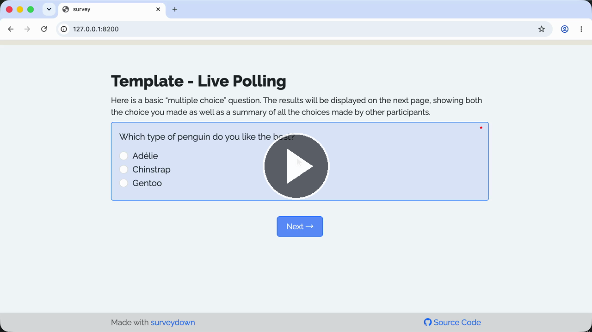

# Template - Live Polling

A reactive question template of live-polling with responses shown as a bar chart.

### See it in action

Watch the **Walkthrough recording:**

[](https://cdn.jsdelivr.net/gh/surveydown-dev/template_live_polling@main/video-recording.mp4)

### Create this template

Run this command in your R console:

```r
surveydown::sd_create_survey(
  #path = "path/to/survey",
  template = "live_polling"
)
```

### Learn more

- [Template page - Live Polling](https://surveydown.org/templates/live_polling)
- [Document page - Reactivity](https://surveydown.org/docs/reactivity.html)
- [Document page - Start with a template](https://surveydown.org/docs/getting-started#start-with-a-template)
